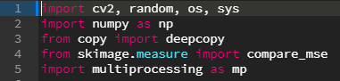

# 빵형과 함께하는 태보해 프로젝트  
  
  
[빵형의 개발도상국 유튜브(https://www.youtube.com/channel/UC9PB9nKYqKEx_N3KM-JVTpg)](https://www.youtube.com/channel/UC9PB9nKYqKEx_N3KM-JVTpg "title")  
  
    
  **저희가 빵형님께 해드릴수 있는건 좋아요, 구독, 댓글뿐입니다**  
  **귀찮으시더라도 한번만 부탁드릴께요!!**

-----------------

## 1장. 진화 알고리즘으로 스폰지밥을 그려보자!
  
   
  [강의영상(https://youtu.be/K19IA240mU4)](https://youtu.be/K19IA240mU4 "title")  
  [소스코드(https://github.com/kairess/genetic_image)](https://github.com/kairess/genetic_image "title")  

### 주제 소개  
절대태보해! 안녕하세요 태보해 프로젝트를 진행하게된 김성록입니다!
저희가 처음으로 구현해볼 것은 '진화 알고리즘'을 통해 원본이미지를 똑같이 그려보는 프로그램입니다.

#### 모듈을 설치하는 방법
  ##### 1. 설치파일로 설치하는 방법  
    1. 설치하려는 모듈을 구글링합니다.  
    2. 모듈을 제공하는 홈페이지에 들어가서 모듈 설치파일을 받습니다.  
    3. 각 모듈에 맞는 환경변수와 설정들을 설정해줍니다.    
      * 모듈마다 설치하는 방법이 다르니 꼭 구글링 해보시길 바랍니다!

  ##### 2. 명령어로 설치하는 방법  
    1. 설치하려는 모듈을 구글링합니다.  
    2. 모듈을 설치하는 명령어를 찾아서 입력합니다.  
      * 현재경로와 무관하게 치면 됩니다.  
      * 대부분 pip install (모듈 이름) 형식으로 설치가 가능  
      * 가끔씩 형식이 다른 경우도 있기때문에 구글링하는 것을 추천드려요  
      ex) Opencv의 경우 : pip install Opencv-python  
        
      * 주의할 점 :  어떤 모듈들은 꼭 선행해서 받아야 할 모듈이 있는 경우도 있습니다!!   
      ex) dlib 모듈은 cmake 모듈을 선행해서 받아야 설치가 오류없이 진행됩니다.
　     
      
      
#### 모듈과 함수를 호출하는 방법
  
  ##### 정의
    import (모듈 이름) : 모듈만 호출하는 방법, 코드 내에서 직접 함수를 호출해야합니다.  
    import (모듈 이름) as (대체 이름) : 모듈을 이름을 바꿔서 호출하는 방법, 모듈 이름이 너무 길거나 모호할 때 사용합니다.  
    from (모듈 이름) import (함수 이름) : 모듈 내의 특정 함수만 호출하는 방법.  
    from (모듈 이름) import * : 모듈 내의 모든 함수를 호출하는 방법.  
    
  ##### 예시
       
    import cv2, random, os, sys  
    -> “cv2(opencv모듈의 이름) , random, os, sys 모듈을 import 하라”  
  
    import numpy as np  
    -> “numpy 모듈을 np로 import 하라”   
  
    from copy import deepcopy  
    -> “copy 모듈의 deepcopy 함수를 import 하라”
  
    from skimage.measure import compare_mse  
    -> “skimage(scikit-image모듈의 이름).measure(skimage의 하위모듈) 모듈의 compare_mse 함수를 import 하라”  
  
    import multiprocessing as mp  
    -> multiprocessing 모듈을 mp로 import 하라”
 

  
sys.argv[] 함수

  
  
      
### sys 모듈 - argv[] 함수

##### 함수 의미
    개발자가 입력하는 명령어를 string으로 받는 함수  

##### 입력 형식
    sys.argv[int]  
    
##### 반환 형식
    string
    
##### 사용 방법   
    1. import sys ( sys 모듈을 import 해줍니다.)   
    2. sys.argv[n] ( int형의 순서 n을 넣어줍니다.)   
      
##### 사용 예시  
> ###### [cmd창]    
>     python d:\argvTest.py arg1 arg2  
> ###### [결과창]
>     argv[0] value = argvTest (파일이름;디폴트값)  
>     argv[1] value = arg1  
>     argv[2] value = arg2  
    
 -----------

  

