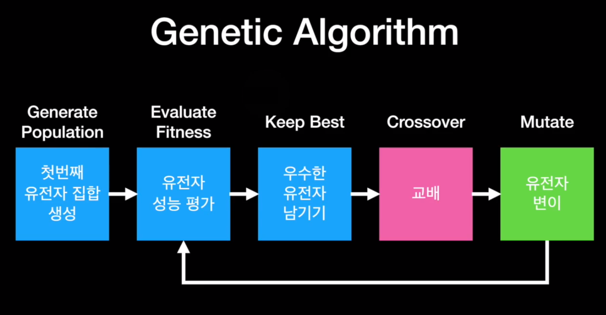
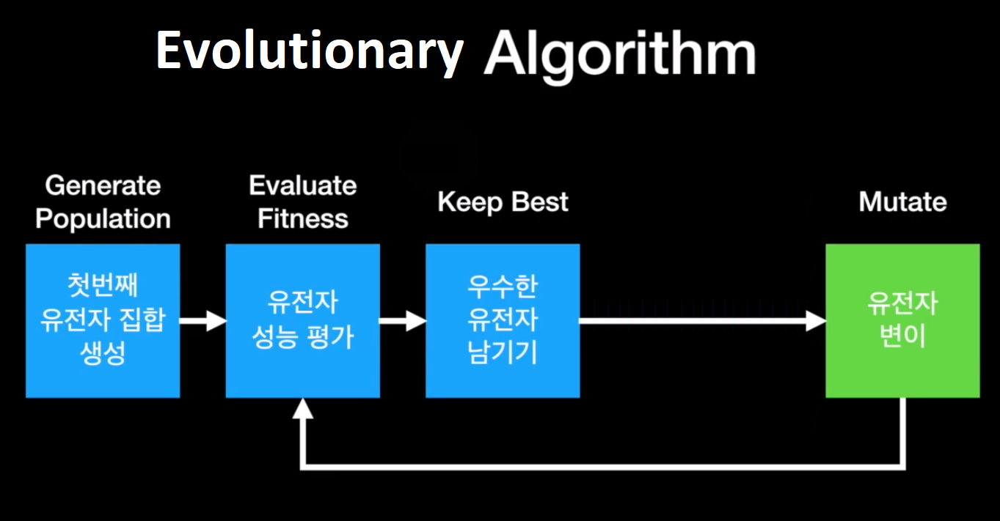
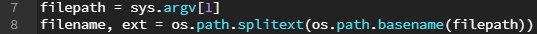

# 빵형과 함께하는 태보해 프로젝트  
  
  
[빵형의 개발도상국 유튜브(https://www.youtube.com/channel/UC9PB9nKYqKEx_N3KM-JVTpg)](https://www.youtube.com/channel/UC9PB9nKYqKEx_N3KM-JVTpg "title")  
  
 #### 저희가 빵형님께 해드릴수 있는건 좋아요, 구독, 댓글뿐입니다  
 #### 귀찮으시더라도 한번만 부탁드릴께요!!  
　  
　  
 　 
-----------------

## 1장. 진화 알고리즘으로 스폰지밥을 그려보자!
  
   
  [강의영상(https://youtu.be/K19IA240mU4)](https://youtu.be/K19IA240mU4 "title")  
  [소스코드(https://github.com/kairess/genetic_image)](https://github.com/kairess/genetic_image "title")  
  
  * 강의영상을 보면서 제 강의는 참고만 하시고, 소스코드를 직접 타이핑하면서 익히시는 것을 추천드립니다.  
　  
　  
  
### 주제 소개  
절대태보해! 안녕하세요 태보해 프로젝트를 진행하게된 김성록입니다!  
저희가 처음으로 구현해볼 것은 '진화 알고리즘'을 통해 원본이미지를 똑같이 그려보는 프로그램입니다.  
  
그래서 저희는 무작위의 (크기, 색깔, 위치)를 가지는 원을 찍어가면서 이 스폰지밥 이미지와 똑같이 되도록 할 거예요.  
  
유전적 알고리즘(진화 알고리즘전에 알고 가셔야 합니다)  
  
    1. random 유전자를 가진 인구 n명 생성(1세대)  
    2. 내가 설정한 목표에 가장 근접한 인구(우수한 유전자) 평가  
    3. 열등한 유전자를 모두 제거  
    4. 우수한 유전자들끼리 교배(더 우수한 유전자 생성)  
    5. 더 우수한 유전자 일부를 유전자가 random인 돌연변이로 대체
    6. 더 우수한 유전자와 돌연변이들(2세대)에 대해서 다시 우수한 유전자를 평가(2번~6번과정 반복)  
  
  
  
진화 알고리즘(교배로 인한 자식들이 아니라 자기 자신이 변이한다)  
그러면 2세대들은 우수한 유전자(1세대) + 돌연변이된 1세대 가 되겠죠?  
  
저희에게는 유전자가 원의 크기, 색깔, 위치가 되겠죠?  
우수한 유전자는 원본 이미지인 스폰지밥과 비슷한 유전자일꺼구요.  
자, 그러면 한번 시작해볼까요?  
　  
　   
    
### 강의 내용  
  
#### 모듈 부분　  
   
  
  
#### 모듈을 설치하는 방법
  ##### 1. 설치파일로 설치하는 방법  
    1. 설치하려는 모듈을 구글링합니다.  
    2. 모듈을 제공하는 홈페이지에 들어가서 모듈 설치파일을 받습니다.  
    3. 각 모듈에 맞는 환경변수와 설정들을 설정해줍니다.    
      * 모듈마다 설치하는 방법이 다르니 꼭 구글링 해보시길 바랍니다!

  ##### 2. 명령어로 설치하는 방법  
    1. 설치하려는 모듈을 구글링합니다.  
    2. 모듈을 설치하는 명령어를 찾아서 입력합니다.  
      * 현재경로와 무관하게 치면 됩니다.  
      * 대부분 pip install (모듈 이름) 형식으로 설치가 가능  
      * 가끔씩 형식이 다른 경우도 있기때문에 구글링하는 것을 추천드려요  
      ex) Opencv의 경우 : pip install Opencv-python  
        
      * 주의할 점 :  어떤 모듈들은 꼭 선행해서 받아야 할 모듈이 있는 경우도 있습니다!!   
      ex) dlib 모듈은 cmake 모듈을 선행해서 받아야 설치가 오류없이 진행됩니다.
　     
          
      
#### 모듈과 함수를 호출하는 방법
  
  ##### 1. 정의
    import (모듈 이름) : 모듈만 호출하는 방법, 코드 내에서 직접 함수를 호출해야합니다.  
    import (모듈 이름) as (대체 이름) : 모듈을 이름을 바꿔서 호출하는 방법, 모듈 이름이 너무 길거나 모호할 때 사용합니다.  
    from (모듈 이름) import (함수 이름) : 모듈 내의 특정 함수만 호출하는 방법.  
    from (모듈 이름) import * : 모듈 내의 모든 함수를 호출하는 방법.  
    
  ##### 2. 예시
       
    import cv2, random, os, sys  
    -> “cv2(opencv모듈의 이름) , random, os, sys 모듈을 import 하라”  
  
    import numpy as np  
    -> “numpy 모듈을 np로 import 하라”   
  
    from copy import deepcopy  
    -> “copy 모듈의 deepcopy 함수를 import 하라”
  
    from skimage.measure import compare_mse  
    -> “skimage(scikit-image모듈의 이름).measure(skimage의 하위모듈) 모듈의 compare_mse 함수를 import 하라”  
  
    import multiprocessing as mp  
    -> multiprocessing 모듈을 mp로 import 하라”
 
  
  
#### 모듈 부분　  
    
**filepath = sys.argv[1]**  
  -> 변수 filepath에 sys.argv[1]를 초기화시켜줍니다.  

  
sys.argv[] 함수

  
  

  ### sys 모듈 - argv[] 함수

  ##### 함수 의미
    개발자가 입력하는 명령어를 string으로 받는 함수  

  ##### 입력 형식
    sys.argv[int]  

  ##### 반환 형식
    string

  ##### 사용 방법   
    1. import sys ( sys 모듈을 import 해줍니다.)   
    2. sys.argv[n] ( int형의 순서 n을 넣어줍니다.)   

  ##### 사용 예시  
  > ###### [cmd창]    
  >     python d:\argvTest.py arg1 arg2  
  > ###### [결과창]
  >     argv[0] value = argvTest (파일이름;디폴트값)  
  >     argv[1] value = arg1  
  >     argv[2] value = arg2  

   -----------

  

  
  
**filename, ext = os.path.splitext(os.path.basename(filepath))**  
  -> filepath에 저장된 파일을 불러와 파일이름과 확장자명을 분리해서 따로 저장해줍니다.  

  
os.path.basename() 함수

  
  

  ### os 모듈 - os.path.basename() 함수

  ##### 함수 의미
    파일을 보여주는 함수 / 형식에 맞지않으면 아무것도 나오지 않습니다.  

  ##### 입력 형식
    os.path.basename(string)

  ##### 반환 형식
    string

  ##### 사용 방법   
    1. import os ( os 모듈을 import 해줍니다.)   
    2. os.path.basename(name) ( string형의 파일경로 name을 넣어줍니다.)   

  ##### 사용 예시  
  > ###### [코드창]    
  >     name = c:\temp\python\data.txt  
  > ###### [결과창]
  >     os.path.basename(name) = “data.txt”  

   -----------

  

  

 
os.path.splitext() 함수

  
  

  ### os 모듈 - os.path.splitext() 함수

  ##### 함수 의미
    확장자만 따로 떨어뜨리는 함수  

  ##### 입력 형식
    os.path.splitext(string)

  ##### 반환 형식
    string, string

  ##### 사용 방법   
    1. import os ( os 모듈을 import 해줍니다.)   
    2. os.path.splitext(name) ( string형의 파일이름 name을 넣어줍니다.)   

  ##### 사용 예시  
  > ###### [코드창]    
  >     name = data.txt 
  > ###### [결과창]
  >     os.path.splitext(name) = “data”, “.txt”  

   -----------

  

  
